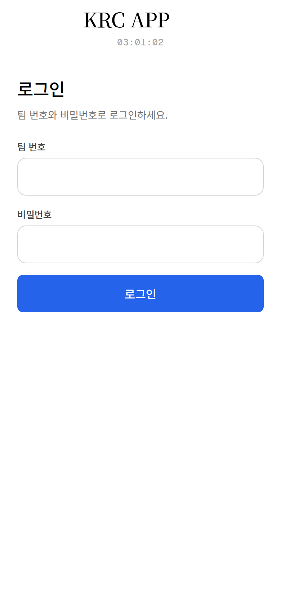
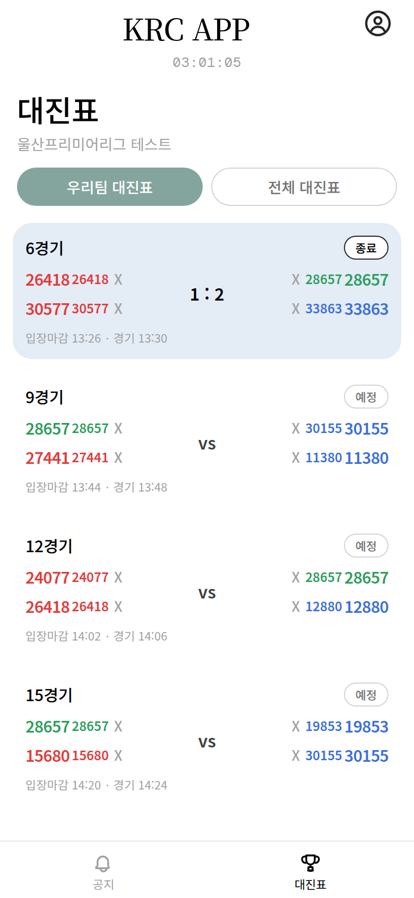
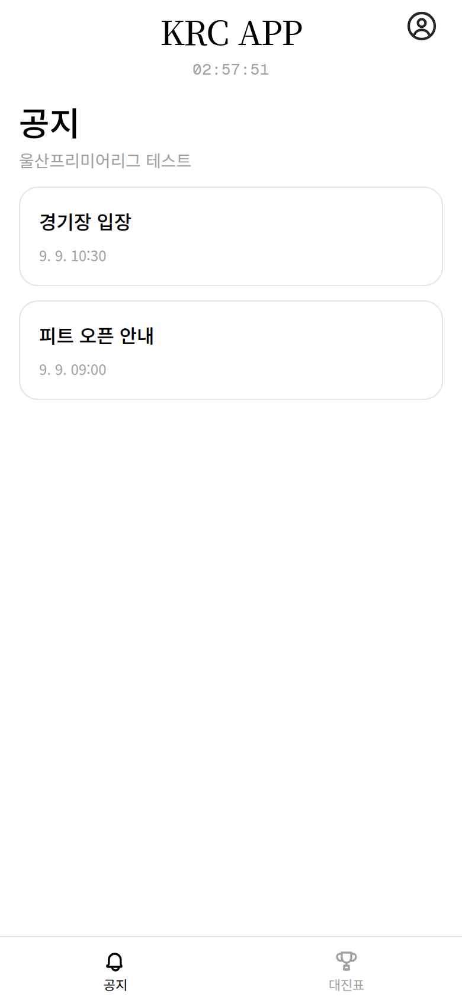
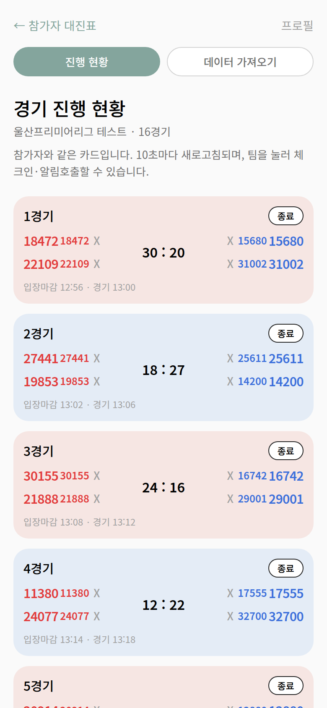
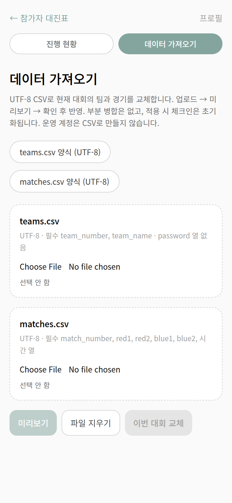

# KRC APP

FTC(First Tech Challenge) 스타일 대회 참가자용 대진표 웹앱입니다. Next.js App Router, TypeScript, Tailwind CSS, Auth.js, Prisma(SQLite), Web Push를 사용합니다.

모바일(~390px) 우선입니다. 참가자는 공지·대진표·체크인 조회를, 운영(staff)은 진행 현황·공지 작성·CSV 가져오기를 씁니다.

## 화면

캡처는 뷰포트 **390×844**, 라이트 모드, 앱 캔버스만입니다. 실기 화면을 다시 찍으면 `docs/screenshots/`에 같은 파일명으로 덮어쓰면 됩니다.

<table>
  <thead>
    <tr>
      <th>팀 번호·비밀번호 로그인</th>
      <th>우리팀 대진표</th>
      <th>공지 목록</th>
    </tr>
  </thead>
  <tbody>
    <tr>
      <td></td>
      <td></td>
      <td></td>
    </tr>
  </tbody>
</table>

<table>
  <thead>
    <tr>
      <th>운영 경기 진행 현황</th>
      <th>CSV 데이터 가져오기</th>
    </tr>
  </thead>
  <tbody>
    <tr>
      <td></td>
      <td></td>
    </tr>
  </tbody>
</table>

## 설치 / 실행

필요 환경: **Node.js 20+**, npm.

```bash
git clone <repo>
cd krcapp
npm install
cp .env.example .env
```

`.env`를 채운 뒤 데이터베이스를 만들고 시드합니다.

```bash
# AUTH_SECRET
openssl rand -base64 32

# VAPID (Web Push) 키
npm run vapid
# 또는: npx web-push generate-vapid-keys
```

`.env` 예시:

```
DATABASE_URL="file:./dev.db"
AUTH_SECRET="긴-랜덤-문자열"
AUTH_URL="http://localhost:3000"
NEXT_PUBLIC_VAPID_PUBLIC_KEY="..."
VAPID_PRIVATE_KEY="..."
VAPID_SUBJECT="mailto:admin@krc.app"
```

```bash
npm run db:setup
npm run dev
```

브라우저에서 [http://localhost:3000](http://localhost:3000) 을 엽니다.

스키마만 반영하려면 `npm run db:push`, 시드만 다시 넣으려면 `npm run db:seed` 입니다.

## 데모 계정

시드(`npm run db:setup` / `npm run db:seed`)가 만드는 계정입니다. 로그인 화면 라벨은 **팀 번호** / **비밀번호**이고, 데모 비밀번호는 이메일 문자열입니다.

| Username | Password | 역할 |
| --- | --- | --- |
| `28657` | `28657@krc.app` | 참가자 (우리팀 대진표) |
| `33863` | `33863@krc.app` | 참가자 (진행중 경기 체크인 표시) |
| `admin` | `admin@krc.app` | 운영 staff (`/admin`, 체크인, 알림호출, CSV) |

로그인 실패 시 팀 번호는 유지하고 비밀번호만 지웁니다. 빨간 배너 `로그인에 실패했습니다. 팀 번호와 비밀번호를 확인해 주세요.` 와 빨간 입력 테두리가 표시됩니다. CTA는 `로그인`(파랑 `#2563eb`)입니다.

시드 데이터: 이벤트 **울산프리미어리그 테스트**, 16경기(종료·진행중·예정 혼합), 공지 2건. 공지가 없으면 `아직 공지가 없습니다`가 표시됩니다.

## 참가자 흐름

1. `/login`에서 팀 번호와 비밀번호로 로그인합니다. 기본 도착지는 **대진표**(`/`, **우리팀** 세그먼트)입니다. 공지에서 로그인하면 공지로 돌아옵니다.
2. **대진표**: 우리팀 / 전체 전환. 경기 카드에서 얼라이언스·점수(또는 `vs`)·체크인 X/O를 보고, 팀을 눌러 체크인 상태를 조회합니다(참가자는 읽기 전용).
3. **공지**: `/notices` 목록(최신순) → `/notices/[id]` 상세. 비로그인도 열람할 수 있습니다. 작성 버튼은 없습니다.
4. 상단 프로필에서 알림 허용·로그아웃. `/?match=n` 으로 해당 경기 카드로 스크롤·하이라이트됩니다.

대진표 탭(`/`, `/bracket`)에서만 새 공지 팝업이 뜹니다. 기존 공지는 첫 방문 때 기준선으로 저장되고, 그 이후 공지만 한 건씩 표시합니다. `닫기` 또는 `공지 보기`한 id는 다시 뜨지 않습니다.

## 운영(staff) 흐름

1. `admin` / `admin@krc.app`으로 로그인한 뒤 프로필 → **경기 진행 현황 (운영)** 또는 `/admin`.
2. **진행 현황**: 참가자와 같은 경기 카드(10초 새로고침). 팀을 눌러 **체크인** / **알림호출**. 아래에서 공지 작성.
3. **데이터 가져오기**: UTF-8 `teams.csv` / `matches.csv` 업로드 → 검증 미리보기 → **이번 대회 교체**. 성공하면 진행 현황으로 돌아갑니다.

`POST /api/checkin`, `POST /api/notify`, `POST /api/admin/import/preview`, `POST /api/admin/import/apply` 는 로그인된 **staff** 세션만 허용합니다. 비로그인 401, 참가자 403. `/admin` 도 staff 전용입니다 (비로그인 → 로그인 페이지, 참가자 → 403).

## 기능

- **공지 / 대진표** 하단 탭 (홈·내 정보 탭 없음, 로그인은 상단 프로필 아이콘)
- **우리팀 대진표 / 전체 대진표** 필터. 로그인 후 기본 탭은 **우리팀**. 게스트는 전체
- 빈 목록: 우리팀 `우리 팀 경기가 아직 없어요` / 전체 `대진표가 준비 중이에요`
- `/?match=n` 로 해당 경기 카드로 스크롤·하이라이트
- 공지 `/notices` 목록(최신순, 제목+시간) → `/notices/[id]` 상세. 비로그인 열람 가능. 작성은 staff만
- 경기 카드: 2v2 레드/블루 얼라이언스, 점수 또는 `vs`, 예정·진행중·종료 배지, 체크인 X/O
- 팀 탭 모달: 참가자는 체크인 상태만 조회. **체크인 / 알림호출** 은 운영만
- 로그인(팀 번호 + 비밀번호), 프로필, 로그아웃
- `/admin` 경기 진행 현황 그리드(10초 자동 새로고침, staff)와 **데이터 가져오기** (CSV)
- 라이브 시계(1초), 대진표 폴링(10초)
- 대진표 탭 새 공지 팝업(한 건씩, 닫기/공지 보기 후 재표시 없음)

## Web Push (무료, VAPID)

유료 푸시 서비스 없이 **Web Push + VAPID** 만 사용합니다.

1. `npm run vapid` 로 키 생성 후 `.env`에 넣습니다.
2. 팀 계정으로 로그인한 뒤 **프로필 → 알림 허용**.
3. 대진표에서 해당 팀을 눌러 **알림호출**.

구독 기기가 없으면 API가 `구독된 기기가 없습니다...`를 반환하고 서버 로그에 `[push] No subscriptions for team ...` 가 남습니다.

### HTTPS / localhost

브라우저 Push API는 **HTTPS** 또는 **localhost** 에서만 동작합니다.

- 로컬: `http://localhost:3000` 은 허용됩니다. `http://127.0.0.1:3000` 이나 LAN IP는 브라우저에 따라 차단됩니다.
- 배포: HTTPS가 필요합니다. `AUTH_URL`을 공개 URL로 맞추세요.
- iOS Safari는 홈 화면 추가(PWA) 후에만 웹 푸시가 되는 경우가 많습니다.
- 알림을 지원하지 않는 브라우저는 프로필에 경고를 표시합니다.

`public/sw.js` 서비스 워커와 `public/manifest.json` 으로 설치 가능한 PWA로 동작합니다.

## 주요 경로

| 경로 | 설명 |
| --- | --- |
| `/` 또는 `/bracket` | 대진표 (`?match=n` 딥링크) |
| `/notices` | 공지 목록 |
| `/notices/[id]` | 공지 상세 |
| `/login` | 로그인 |
| `/profile` | 프로필 · 로그아웃 · 알림 |
| `/admin` | 경기 진행 현황 · CSV 데이터 가져오기 (staff) |

## 관리자 CSV 가져오기

`/admin`에서 **진행 현황 | 데이터 가져오기** 세그먼트를 전환합니다. 운영(staff)만 접근합니다.

### 흐름

1. UTF-8 `teams.csv`와 `matches.csv`를 하나 또는 둘 다 업로드합니다. 페이지에서 양식을 내려받을 수 있습니다 (`/templates/teams.csv`, `/templates/matches.csv`).
2. 서버가 검증한 뒤 미리보기를 보여 줍니다. 오류 행은 빨간색으로 강조됩니다.
3. 오류가 1건이라도 있으면 **이번 대회 교체**가 비활성화됩니다.
4. 확인 대화상자에서 **이번 대회 교체**를 누르면 현재 대회 데이터가 트랜잭션으로 반영됩니다.
5. 성공하면 **진행 현황** 탭으로 이동합니다.

xlsx, Google Sheets, 행 단위 인라인 편집, 기존 경기와의 부분 병합은 지원하지 않습니다. `matches.csv`를 적용하면 해당 파일이 현재 대회의 전체 경기 목록이 됩니다(없는 경기 번호는 삭제, 있는 번호는 upsert).

미리보기 요약 칩 등 CSV UX 개선은 백로그입니다.

### teams.csv

인코딩은 **UTF-8**입니다. 열 이름은 snake_case입니다. **password 열은 없습니다.**

| 열 | 필수 | 설명 |
| --- | --- | --- |
| `team_number` | 예 | 로그인 아이디가 되는 팀 번호 |
| `team_name` | 예 | 팀 이름 |
| `email` | 아니오 | 기본값 `{team_number}@krc.app` |
| `role` | 아니오 | 기본값 `participant`. `staff`/`admin`은 거절 |

적용 시 Team을 upsert하고, 같은 번호의 참가자 User를 upsert합니다. 비밀번호는 기존 앱 규칙과 같이 **이메일 문자열**을 bcrypt로 해시한 값입니다. CSV로 운영 계정을 만들거나 덮어쓰지 않습니다.

### matches.csv

인코딩은 **UTF-8**입니다.

| 열 | 필수 | 설명 |
| --- | --- | --- |
| `match_number` | 예 | 현재 대회 기준 경기 번호 |
| `red1`, `red2`, `blue1`, `blue2` | 예 | 팀 번호. 모르면 해당 행 오류 |
| `entry_close_at` | 예 | `YYYY-MM-DDTHH:mm`(KST) 또는 타임존이 있는 ISO |
| `start_at` | 예 | 동일 |
| `status` | 아니오 | `SCHEDULED`(기본), `IN_PROGRESS`, `FINISHED` |
| `red_score`, `blue_score` | 아니오 | 정수 |

알 수 없는 팀 번호는 미리보기 행 오류입니다. `teams.csv`에 있는 새 번호는 같은 업로드에서 경기에 쓸 수 있습니다.

## 스택

- Next.js App Router + TypeScript + Tailwind CSS
- Auth.js (next-auth v5) Credentials
- Prisma + SQLite
- `web-push` + VAPID

## 스크립트

| 명령 | 설명 |
| --- | --- |
| `npm run dev` | 개발 서버 |
| `npm run build` | 프로덕션 빌드 |
| `npm run start` | 빌드 결과 실행 |
| `npm run db:setup` | `prisma db push` + seed |
| `npm run vapid` | VAPID 키 출력 |
| `npm test` | CSV 가져오기 · 공지 팝업 단위 테스트 |

## 프로덕션 실행

특정 호스팅 업체에 묶이지 않습니다. Node.js 20+가 돌아가는 일반 호스트에서 실행합니다.

`.env`를 프로덕션 값으로 채운 뒤(아래와 `.env.example` 주석 참고) 스키마를 반영하고 빌드합니다. 시드가 필요하면 `npm run db:setup`, 스키마만이면 `npm run db:push`입니다.

```bash
npm run build && npm start
```

기본 포트는 3000입니다. `PORT`로 바꿀 수 있습니다. `AUTH_SECRET`과 VAPID 개인키는 저장소에 커밋하지 마세요.

### AUTH_URL과 VAPID (localhost 금지)

프로덕션에서는 **실제 공개 URL**을 씁니다. `localhost` / `127.0.0.1`은 개발 전용입니다.

- `AUTH_URL`: 사용자가 여는 origin. 예 `https://krc.example.com` (끝 슬래시 없음). 배포는 HTTPS가 필요합니다.
- VAPID: `npm run vapid`로 **프로덕션용** 공개/개인 키 쌍을 만들고 `NEXT_PUBLIC_VAPID_PUBLIC_KEY` / `VAPID_PRIVATE_KEY`에 넣습니다. `VAPID_SUBJECT`는 `mailto:운영자@실제도메인` 또는 같은 공개 HTTPS URL이어야 하며 localhost를 넣지 마세요.
- `NEXT_PUBLIC_VAPID_PUBLIC_KEY`는 `npm run build` 때 클라이언트 번들에 들어갑니다. 키를 바꾸면 다시 빌드하세요.

### SQLite 파일 경로

`DATABASE_URL="file:./dev.db"`는 **`prisma/` 디렉터리 기준** 상대 경로라서 실제 파일은 `prisma/dev.db`입니다.

- 재시작·재배포 후에도 남는 **영구 디스크**의 절대 경로를 쓰세요. 예: `DATABASE_URL="file:/var/lib/krcapp/prod.db"`
- 임시 파일시스템에 두면 대진표·계정·푸시 구독이 재시작 때 사라집니다.
- 프로세스에 쓰기 권한이 있어야 하고, 같은 디렉터리에 `.db-wal` / `.db-shm`이 생깁니다.
- SQLite는 한 호스트의 로컬 파일에 맞습니다. 읽기 전용 디스크나 요청마다 디스크가 비는 환경에는 맞지 않습니다.
